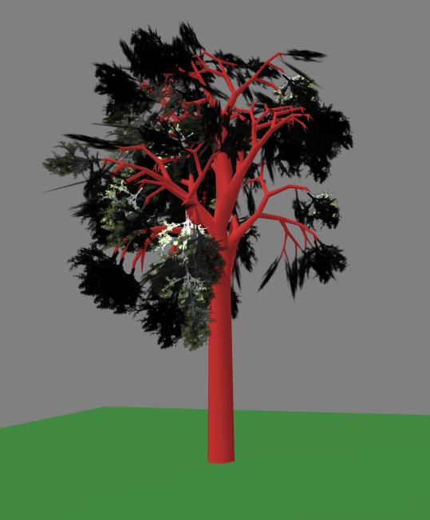

# aframe-proctree-component

AFRAME **proctree** component for generating procedural trees using https://github.com/supereggbert/proctree.js/ from supereggbert.

The system generates two object3Ds, "trunk" for the trunk and "mesh" for the twigs (the twigs can be modified with the material component)

Demo at https://harlyq.github.io/aframe-proctree-component/ (twig-1 from donmccurdy)



## Examples

```html
<head>
  <script src="https://aframe.io/releases/0.8.0/aframe.min.js"></script>
  <script src="https://unpkg.com/aframe-proctree-component@^0.1.0/dist/aframe-proctree-component.min.js"></script>
</head>
<body>
  <a-scene>
    <a-entity proctree material="src: url(assets/twig-1.png); color: white; transparent: true; depthWrite: false; side: double" position="0 0 -10"></a-entity>
  </a-scene>
</body>
```

## Properties

**seed** - seed for the psuedo random number generator. if negative, then use randomly generate a seed at startup (*int*) default 262

**segments** - number of faces for the trunk and branches (*int*) default 6

**levels** - number of branching stages (*int*) default 5

**twigScale** - scale of the twig planes (*number) default: 0.39

**initialBranchLength** - length of the first branch in m (*number*) default 0.49

**lengthFalloffFactor** - branch length = (parent branch length ^ lengthFalloffPower) * lengthFalloffFactor (*number*) default 0.85

**lengthFalloffPower** - branch length = (parent branch length ^ lengthFalloffPower) * lengthFalloffFactor (*number*) default 0.99

**clumpMax** - upper bound for how much branches clump (*number*) default 0.454

**clumpMin** - lower bound for how much branches clump (*number*) default 0.404

**branchFactor** - factor defining how close branches are together. a lower number is closer together (*number*) default 2.45

**dropAmount** - factor determining how much non-primary branches drop. numbers above 0 raise, and below 0 droop (*number*) default -0.1

**growAmount** - facter affecting how much branches grow. negative numbers grow downwards and positive number upwards (*number*) default 0.235

**sweepAmount** - makes branches sweep left or right. 0 is no sweep, sweep increasing as positive or negative increases (*number*) default 0.01

**maxRadius** - the radius of the main trunk (which impacts the radius of all sub elements) (*number*) default 0.139

**climbRate** - how high the tree climbs at each treeStep (*number*) default 0.371

**trunkKink** - defines the trunk deviation. 0 is no deviation (*number*) default 0.093

**treeSteps** - the number of verticle stages in the tree (*int*) default 5

**taperRate** - changes the thickness of the trunk and branches the higher they go, or the further they branch.  the smaller the number the more tapered the branches (*number*) default 0.947

**radiusFalloffRate** - the rate of change of the thickness of branches (*number*) default 0.73

**twistRate** - the twisting of branches around the trunk. 0 is no twisting (*number*) default 3.02

**trunkColor** - colour of the trunk (*color*) default brown

**trunkLength** - the height of the trunk below the first branch (*number*) default 2.4

**vMultiplier** - TBD (*number*) default 2.36

